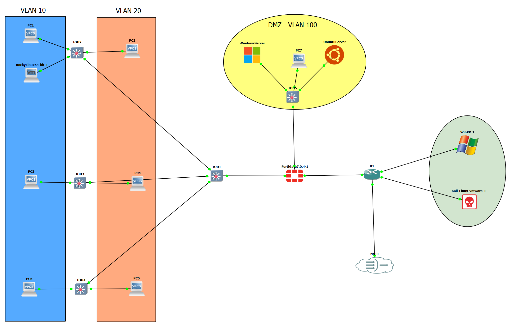

# Projet de Simulation Réseau GNS3

Ce projet simule un réseau d'entreprise complet avec segmentation, DMZ et sécurité implémentée via FortiGate.

## Architecture du réseau

- **Réseau interne**: 3 étages avec VLANs 10 et 20
- **DMZ**: Héberge des serveurs (Windows et Ubuntu)
- **Security**: Implémentation FortiGate avec politiques de sécurité
- **WAN**: Simulation d'internet avec routeur Cisco

## Topologie

La topologie est composée de:
- PCs 
- 3 Switches d'étage
- 1 Switch global L3
- 1 Switch DMZ
- 1 FortiGate VM
- 1 Routeur Cisco (FAI)
- Plusieurs VMs (Windows Server, Ubuntu Server, Kali Linux, Windows XP)

## Plan d'adressage IP

- **VLAN 10**: 192.168.10.0/24
- **VLAN 20**: 192.168.20.0/24
- **DMZ**: 10.0.0.0/24
- **WAN**: 203.0.113.0/24

## Sécurité

Le projet inclut plusieurs scripts de durcissement et configurations de sécurité:
- Durcissement Windows et Ubuntu
- Configuration FortiGate avec politiques de sécurité
- Configuration sécurisée des switches
- Proxy Squid dans la DMZ

## Instructions d'installation

1. Importez la topologie dans GNS3
2. Configurez les appareils selon les fichiers de configuration
3. Appliquez les scripts de durcissement sur les serveurs

## Fichiers de configuration

- `Switches/`: Configurations des switches
- `FortiGate/`: Configuration du FortiGate
- `Routeur/`: Configuration du routeur
- `Serveurs/`: Scripts pour les serveurs
- `Scripts/`: Scripts de durcissement et autres utilitaires
- `Projet/`: fichier GNS3

